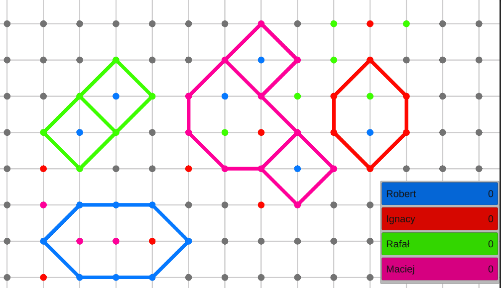

# GameOfDots
## Oldschool game of dots usually played in notebooks, recreated in Unity
Unfortunately, this project is unfinished. The idea was to create an online version of the classic Dots game, allowing up to four players to join simultaneously. The game includes features for detecting surrounded dots.
## Screenshots

